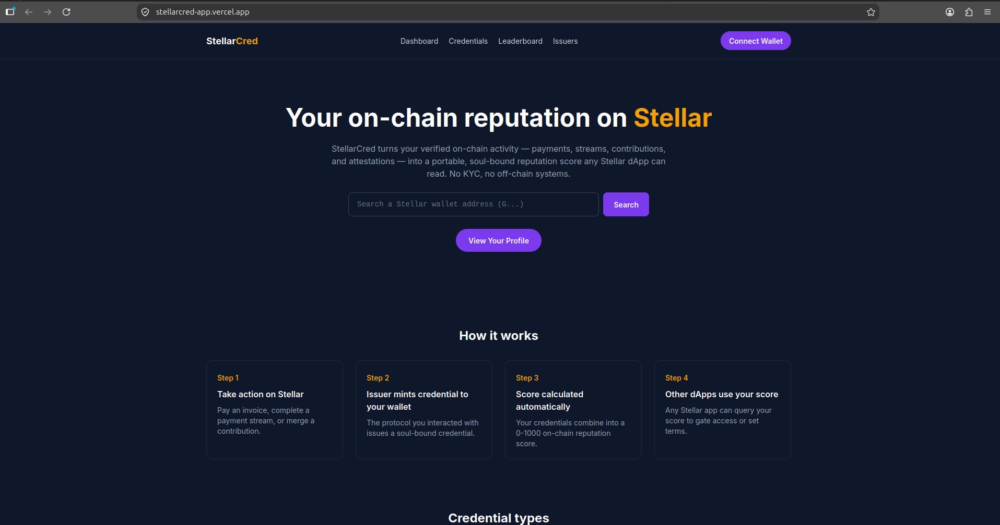

# StellarCred App

**On-chain behavioral reputation and credential protocol on Stellar Soroban — public reputation profiles and credential explorer**


**Live app:** [stellarcred-app.vercel.app](https://stellarcred-app.vercel.app/)



## What is StellarCred

StellarCred is the first on-chain behavioral reputation and credential
protocol on Stellar Soroban. Registered protocols issue soul-bound
(non-transferable) credentials to wallet addresses based on verified
on-chain activity, aggregating into a public 0-1000 reputation score. This
app is the public-facing explorer: search any wallet's score and
credentials, browse the leaderboard and registered issuers, and manage your
own profile.

- Contracts: [stellarcred-contracts](https://github.com/Stellar-Cred/stellarcred-contracts)
- SDK: [@stellar-cred/sdk](https://github.com/Stellar-Cred/stellarcred-sdk)

## Tech Stack

- Next.js 16 (App Router, Turbopack)
- React 19
- TypeScript 5 (strict)
- Tailwind CSS 3
- [`@stellar-cred/sdk`](https://www.npmjs.com/package/@stellar-cred/sdk) for
  all on-chain reads/writes and the Freighter wallet adapter

## Local Setup

```bash
git clone git@github.com:Stellar-Cred/stellarcred-app.git
cd stellarcred-app
cp .env.example .env.local
npm install
npm run dev
```

Then open [http://localhost:3000](http://localhost:3000).

```bash
npm run typecheck   # tsc --noEmit
npm run lint         # eslint .
npm run build         # production build
```

## Environment Variables

| Variable | Description |
|---|---|
| `NEXT_PUBLIC_STELLAR_NETWORK` | `testnet`, `mainnet`, or `futurenet` |
| `NEXT_PUBLIC_CONTRACT_ID` | The deployed StellarCred `CredContract` ID |
| `NEXT_PUBLIC_RPC_URL` | Soroban RPC endpoint (defaults per network if omitted) |

## Pages

| Route | Description |
|---|---|
| `/` | Landing page — how it works, credential types, wallet search |
| `/dashboard` | Your own profile (requires a connected Freighter wallet) |
| `/profile/[address]` | Any wallet's public reputation profile |
| `/credentials` | All credential types, points, and how to earn them |
| `/leaderboard` | Top 100 wallets by score |
| `/issuers` | All registered credential issuers |
| `/verify/[address]` | Quick yes/no check for a specific credential on a wallet |

## Contributing via Drips Wave

This repo participates in the [Drips Stellar Wave](https://www.drips.network/wave/stellar).
Open issues are tagged `complexity: trivial`, `complexity: medium`, or
`complexity: high` with a Point value attached. See
[CONTRIBUTING.md](CONTRIBUTING.md) before picking up an issue — in
particular, **do not start work until you've been assigned**.
